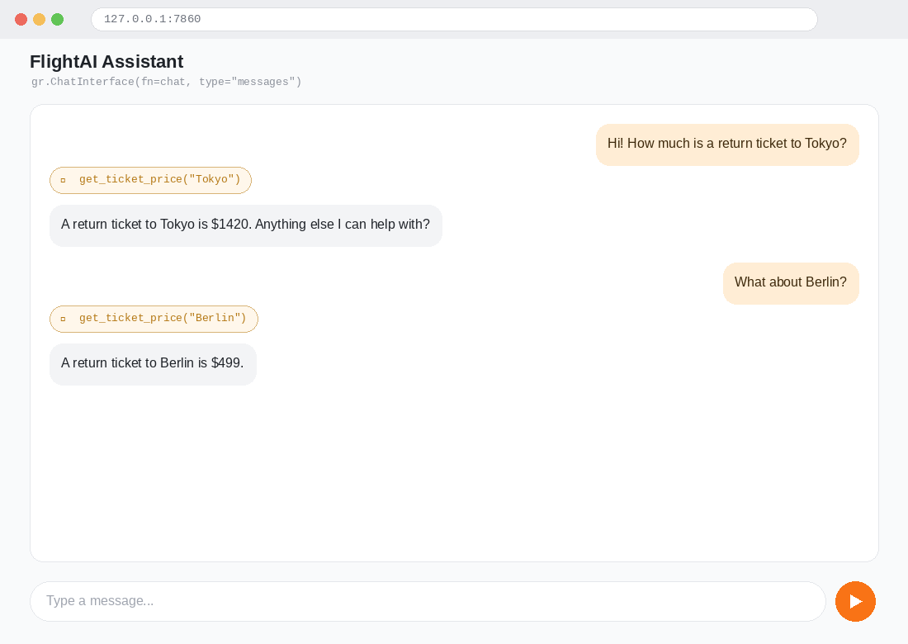
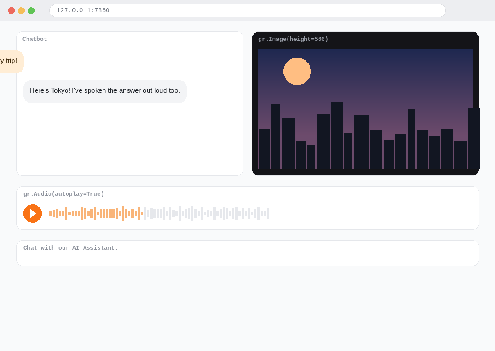

# Airline AI Assistant ✈️

An AI-powered customer support assistant for a fictional airline, **FlightAI**, built with OpenAI-compatible chat models, tool calling, a Gradio chat UI, SQLite-backed ticket prices, and multimodal (image + audio) responses.

## Overview

This project walks through building an airline customer support chatbot in progressive stages:

1. A basic conversational chatbot using a system prompt and Gradio's `ChatInterface`.
2. Adding **tool calling** so the LLM can look up real ticket prices instead of hallucinating them.
3. Swapping a hardcoded Python dictionary for a **SQLite database** (`prices.db`) as the source of truth for prices.
4. Extending the assistant to be **multimodal** — generating a destination image with DALL-E-3 and a spoken response with OpenAI's TTS model, all wired into a custom `gr.Blocks` UI.


## Application Preview

### Chat Assistant

<p align="center">
  
</p>

### Multimodal Assistant

<p align="center">
  
</p>


## Files

| File | Description |
|---|---|
| `airline_assistant_tools.ipynb` | Builds up the assistant step-by-step: plain chatbot → single tool call → multiple tool calls → tool-calling loop, then migrates the price lookup from an in-memory dict to the SQLite `prices.db` database. |
| `airline_assistant_using_database.ipynb` | The more complete version — ticket prices are read from `prices.db` from the start, and the assistant is extended with **DALL-E-3 image generation** (`artist()`) and **text-to-speech** (`talker()`) to create a full multimodal experience inside a custom Gradio `Blocks` UI. |
| `prices.db` | SQLite database (table: `prices(city TEXT PRIMARY KEY, price REAL)`) used for ticket price lookups. |
| `requirements.txt` | Python dependencies for the project environment. |

## Key Concepts Covered

- **System prompts** for setting assistant persona and tone
- **Function/tool calling**: defining a JSON schema for `get_ticket_price`, handling `tool_calls` in the response, and looping until the model returns a final answer
- **Database-backed tools**: reading/writing ticket prices via `sqlite3` instead of hardcoded data
- **Multimodal generation**: DALL-E-3 for destination images, `gpt-4o-mini-tts` for voice responses
- **Gradio UI patterns**: `gr.ChatInterface` for quick prototyping vs. `gr.Blocks` for a fully custom layout (chatbot + image + audio + textbox)

## Setup

```bash
pip install -r requirements.txt
jupyter lab
```

1. Create a `.env` file with your API key(s), e.g.:

2. Open either notebook and set the `MODEL` variable and `OpenAI(...)` client config (base URL / API key) to match the provider you're using (OpenAI, Ollama, or another OpenAI-compatible endpoint).
3. Run the cells in order — the database notebook will create/read `prices.db` in the same folder.

## Notes

- Image generation with DALL-E-3 costs a small amount per call (~$0.04) — use sparingly.
- Ticket prices in `prices.db` currently include: London, Paris, Tokyo, Sydney (add more via the `set_ticket_price(city, price)` helper).
